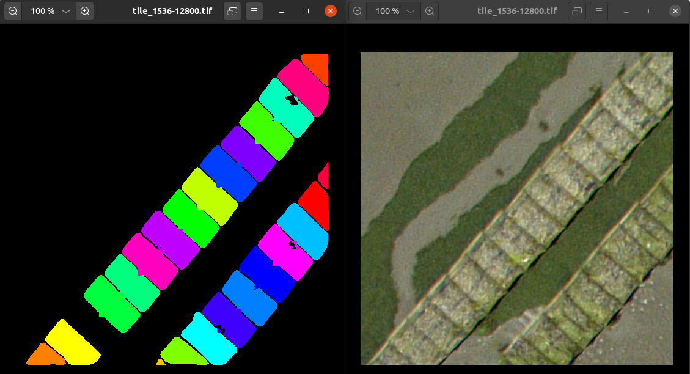

# Projet Cerema


# Installation
Télécharger le répertoire
```bash
git clone https://gitlab.imt-atlantique.fr/05-projet-ce-2020/backend
cd backend
```
### Mise en place de l'environnement Python
Installer [anaconda/miniconda](https://docs.conda.io/en/latest/miniconda.html).

Avec un anaconda shell, créer un environnement à partir d'un des fichiers .yml (windows/linux) :
```bash
conda env create -f environment_(windows/linux).yml
conda activate backend
```
Installer Mask-RCNN manuellement :
 - télécharger https://github.com/matterport/Mask_RCNN/archive/master.zip
 - Dézipper le fichier
 - Dans un shell :
```bash
 conda activate backend
 cd Mask_RCNN
 python setup.py install
```
Installer [Redis](https://redis.io/) (disponible sur Windows et Linux).

# Utilisation
### Lancer Redis
Sur Windows, exécuter le binaire `redis-server.exe`.

Sur Linux, redis devrait déjà être lancé. `systemctl status redis` pour vérifier.

### Lancer flask
Dans le répertoire principal :
 ```bash
 python app.py
 ```
### Lancer celery
Toujour dans le répertoire principal :
 ```bash
 celery -A app.celery worker
 ```
## Test
```bash
 curl -X POST -F "path=/path/to/raster" "http://127.0.0.1:5000/api/load"
```
Charge la photo. Renvoie un lien pour voir l'état d'avancement du chargement.
```bash
 curl -X GET "http://127.0.0.1:5000/api/detection?image_id=0&minLon=-2.302&maxLon=-2.301&minLat=48.6435&maxLat=48.6445&type=oyster_pocket"
```
Lance la détection. Renvoie un lien pour voir l'état d'avancement de la détection.
